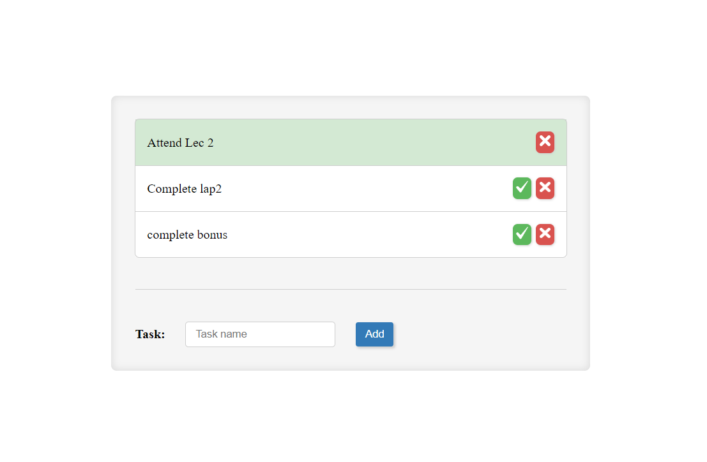

# Todo List Project

## Overview

This Todo List application is designed with simplicity in mind, using HTML, CSS, and JavaScript. It allows users to effortlessly add, mark as done, and delete tasks.

Live Website
[Explore the Todo List](https://FatmaElzahraaAhmed.github.io/JSTodoList)

## Usage

1. Open `index.html` in a web browser.
2. Add tasks by entering a task name and clicking "Add."
3. Mark tasks as done or delete them.

## Functionality

- **Add Task**: Input a task, then click "Add."
- **Mark as Done**: Click "Done" to toggle task status.
- **Delete Task**: Click "Delete" to remove a task.

## Styling

- Clean and straightforward design in `styles/style.css`.

## Implementation

- JavaScript manages user interactions.
- Functions like `addTask`, `deleteTask`, `markAsDone` handle core functionality.

Customize this Todo List project to suit your needs.